  

  <a href="https://kaiksouza.vercel.app/"><strong>🌐 Meu portfólio</strong></a> ·
  <a href="https://www.linkedin.com/in/kaiksouza"><strong>💼 LinkedIn</strong></a> ·
  <a href="mailto:kaiksousalima@gmail.com"><strong>✉️ Vamos conversar</strong></a>

## 👋 Por trás do teclado

Sou **Kaik Souza**, desenvolvedor com foco em **backend Java e Spring Boot**, em busca de oportunidades **Júnior**. Sou formado em **Análise e Desenvolvimento de Sistemas** pela Anhanguera (junho de 2026).

Comecei no suporte de TI e hoje atuo como Desenvolvedor Full Stack na Alest Consultoria, com APIs, integrações e manutenção de sistemas. Aqui compartilho meus projetos de estudo e o que vou aprendendo pelo caminho.

## 🧰 O que tem na minha bancada

| Foco | Tecnologias e conhecimentos |
| :--- | :--- |
| **☕ Backend Java** | Java · Spring Boot · APIs REST · Spring Data JPA · Bean Validation |
| **🗃️ Dados e testes** | SQL · H2 · JUnit 5 · MockMvc · Maven |
| **☁️ Cloud e segurança** | AWS · IAM · KMS · CloudTrail · AWS Config |
| **🔧 Experiência profissional** | Git · Liquibase · C#/.NET · Python · Node.js |

As tecnologias de cada entrega estão descritas no projeto e na minha experiência profissional no LinkedIn.

## 🚀 Do código para a prática

### 🩺 [Ficha de Emergência - API REST](https://github.com/kaik1604/AppEmergenciaMedica)

**Java 21 · Spring Boot · Spring Data JPA · H2 · JUnit 5 · MockMvc**

Evoluí minha aplicação de terminal para uma API REST de fichas de emergência.

- Cadastro, consulta, atualização, exclusão, paginação e exportação em texto.
- Validação com Bean Validation e respostas de erro no formato Problem Details.
- Separação em controller, service e repository, com DTOs para entrada e saída.
- Persistência em H2 e testes de integração com JUnit 5 e MockMvc.
- README com instruções de execução, exemplos de requisições e testes.

Projeto de estudo com dados fictícios. A versão original de terminal está preservada em `legacy/`. PostgreSQL, autenticação e implantação em nuvem são próximos passos, ainda não implementados.

[**Explorar o código →**](https://github.com/kaik1604/AppEmergenciaMedica)

### 🧑‍💻 [Meu portfólio](https://kaiksouza.vercel.app/)

**Next.js · React · TypeScript**

Minha trajetória, projetos e conhecimentos em um só lugar, com versões em português e inglês.

[**Abrir o site →**](https://kaiksouza.vercel.app/)

## 🛡️ Segurança também faz parte

**AWS Certified Security - Specialty**  
Emitida em **26/03/2026** · Válida até **26/03/2029**

Identidade e acesso, criptografia, monitoramento e governança na AWS.

[**Validar minha certificação na AWS →**](https://cp.certmetrics.com/amazon/en/public/verify/credential/adba76269c46425ba46bc7394f82e5d9)

<strong>🌎 A quick hello in English</strong>

I'm **Kaik Souza**, a developer focused on **Java and Spring Boot**, looking for **Junior Java Backend Developer** opportunities. I completed my degree in Systems Analysis and Development in June 2026 and hold the AWS Certified Security - Specialty certification.

My featured project is a Java 21 REST API with Spring Boot, JPA, H2, input validation and integration tests. My professional background includes IT support and full-stack development, API integrations and system maintenance.

---

**Buscando um desenvolvedor Java Júnior? Vamos conversar.**  
[kaiksousalima@gmail.com](mailto:kaiksousalima@gmail.com) · [LinkedIn](https://www.linkedin.com/in/kaiksouza) · [Instagram](https://www.instagram.com/kaiksouzza/)
